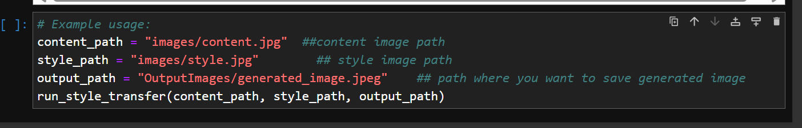

# Neural Style Transfer
======================

## Project Overview
This project implements a neural style transfer algorithm using TensorFlow and Keras. It allows users to generate an image that combines the content of one image with the style of another image.
Neural Style Transfer (NST) is an exciting and innovative application of deep learning that involves reimagining one image (the content image) in the style of another image (the style image). This process uses convolutional neural networks (CNNs), specifically leveraging a pre-trained model like VGG19, to extract and combine the content and style features of the input images to generate a new, stylized image.

## Installation Instructions
### Environment Setup

1. Install and setup jupyter notebook.

### Running the Project

1. Clone the repository using `git clone https://github.com/your-username/neural-style-transfer.git`.
2. Open Jupyter Notebook home page.
3. Navigate to the project directory  `neural-style-transfer`.
4. Add paths for style content and output image.
5. Run the script notebook.

## Usage
### Running the Script

The script takes three command-line arguments:

* `content_image_path`: The path to the content image.
* `style_image_path`: The path to the style image.
* `output_image_path`: The path to save the generated image.

Example usage:

### Input Images
Add the content and style images in images folder

### Generated Image
The generated image will be visible in OutputImages folder

### Customizing the Script

You can customize the script by modifying the following variables:

* `content_layers`: A list of layer names for content extraction.
* `style_layers`: A list of layer names for style extraction.
* `style_weight`: The weight for style loss.
* `content_weight`: The weight for content loss.
* `tv_weight`: The weight for total variation loss.
* `num_steps`: The number of training steps.

## Dependencies
### Required Libraries

* TensorFlow (2.4.0 or later)
* Keras (2.4.0 or later)
* NumPy (1.20.0 or later)
* Matplotlib (3.4.2 or later)

### Optional Libraries

* OpenCV (4.5.3 or later) for image processing.

Note: The version numbers are subject to change, and you may need to update the dependencies accordingly.